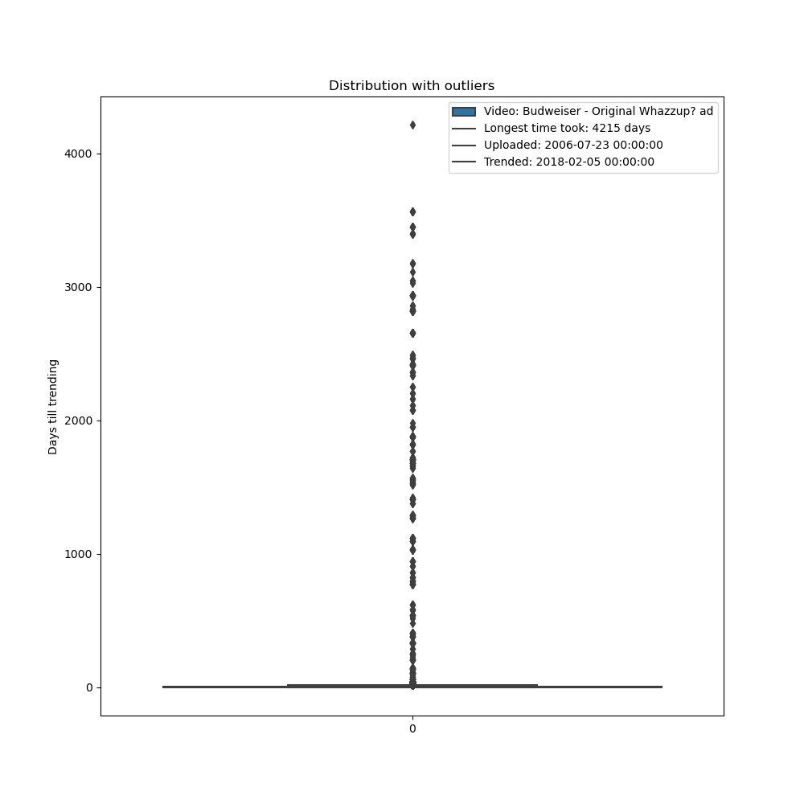
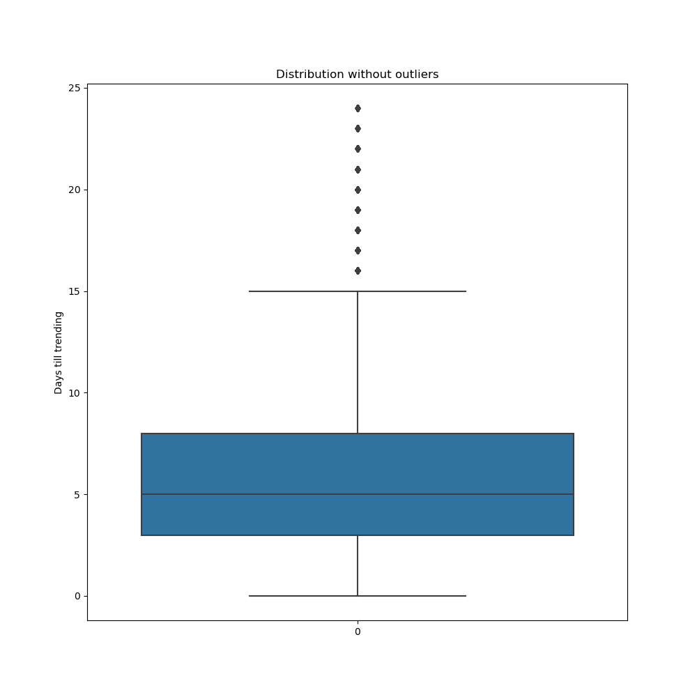
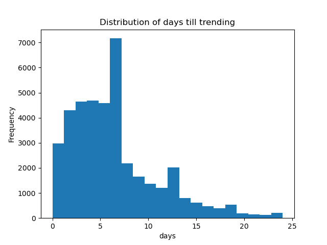
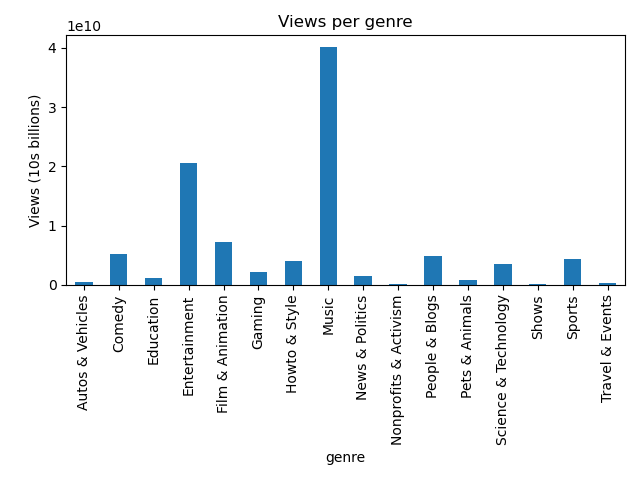
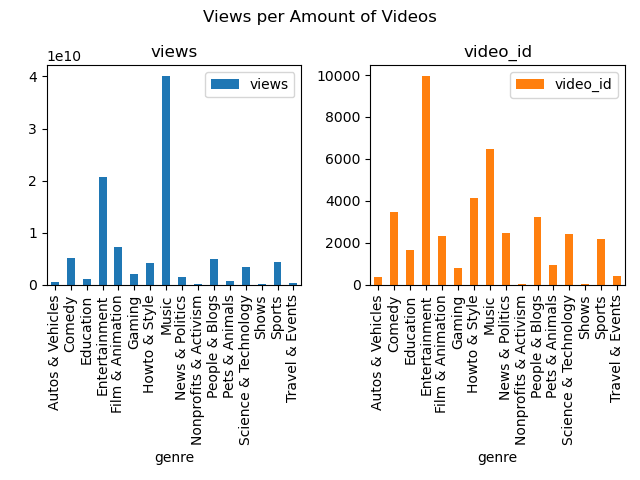
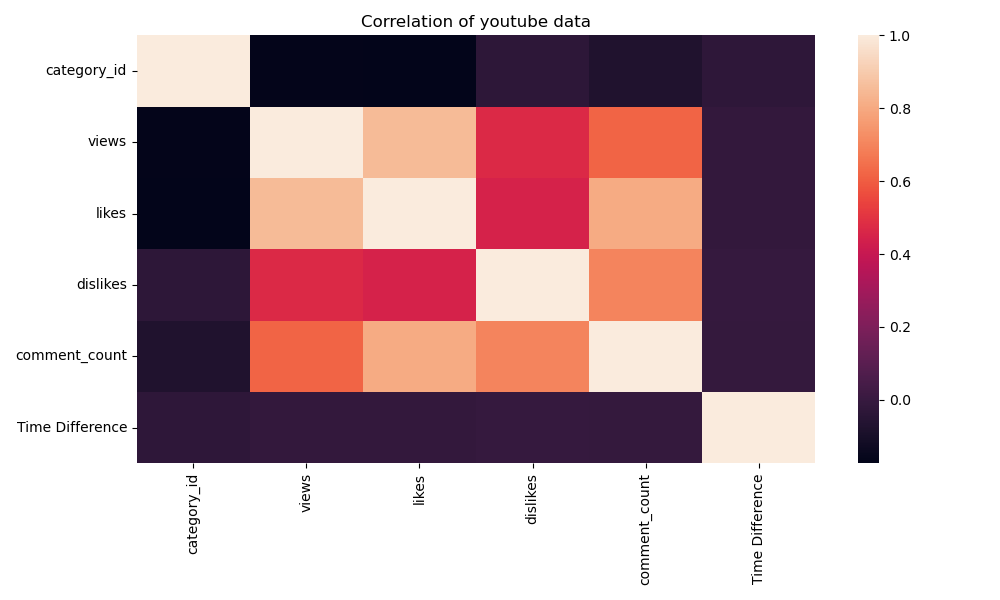

# YouTube Trending Videos Analysis

This project analyzes YouTube trending videos data to understand the characteristics of videos that trend on YouTube. 

The data is too big to store on github. Files to download from [Kaggle](https://www.kaggle.com/datasets/datasnaek/youtube-new/data?select=USvideos.csv). 

## Table of Contents

- [Dependencies](#dependencies)
- [How to Run](#how-to-run)
- [Description of the Analysis](#description-of-the-analysis)
- [Output](#output)

## Dependencies

The project uses the following Python libraries:

- pandas
- matplotlib
- seaborn
- datetime

The project also uses custom modules `create_plots` and `clean` from the `src` directory.

## How to Run

To run the main script, main.py 

## Description of the Analysis

The script performs an analysis on YouTube videos data, which is read from `youtube_data/USvideos.csv`. The steps of the analysis are as follows:

1. **Parsing Dates:** The `publish_time` and `trending_date` fields are parsed to datetime.
2. **Mapping Categories to Genres:** The `category_id` field is mapped to a genre using a JSON file.
3. **Calculating Time Difference:** The time difference between the publish time and the trending date is calculated.
4. **Removing Outliers:** Outliers are removed from the data where the time difference is more than 25 days.
5. **Grouping by Genre:** The data is grouped by genre and the total views and the number of videos per genre are calculated.
6. **Creating Box Plots:** Box plots of the distribution of the time difference are created, both with and without outliers.

   

   

7. **Creating a Histogram:** A histogram of the distribution of the time difference without outliers is created.

   

8. **Creating Bar Plots:** Bar plots are created showing the total views per genre and the total views and the number of videos per genre.

   

   

9. **Checking correlationship between genre, likes, dislikes, comment counts, and time difference using heatmap.
    
   

## Output

The script generates several plots and saves them in the current directory. The plots include box plots, a histogram, and bar plots. The plots are also displayed above in the description of the analysis.

